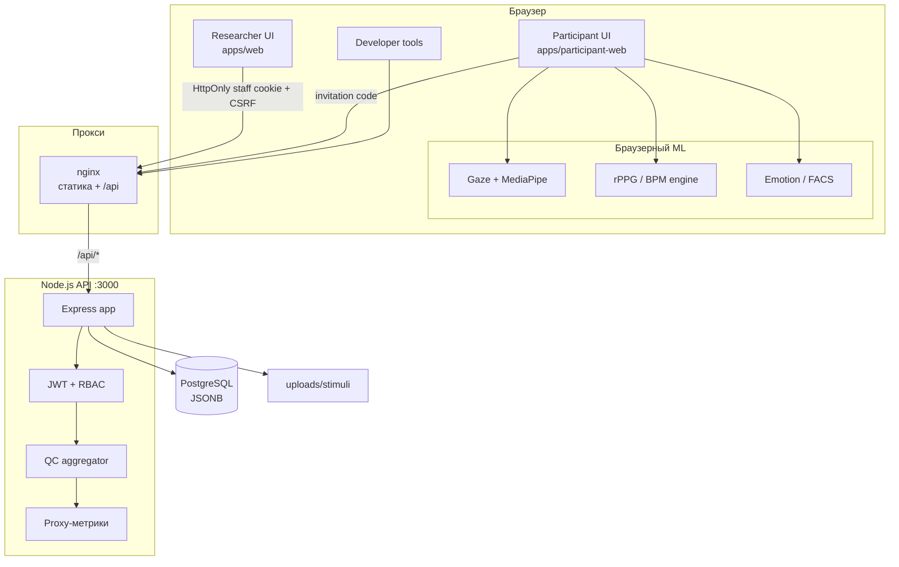
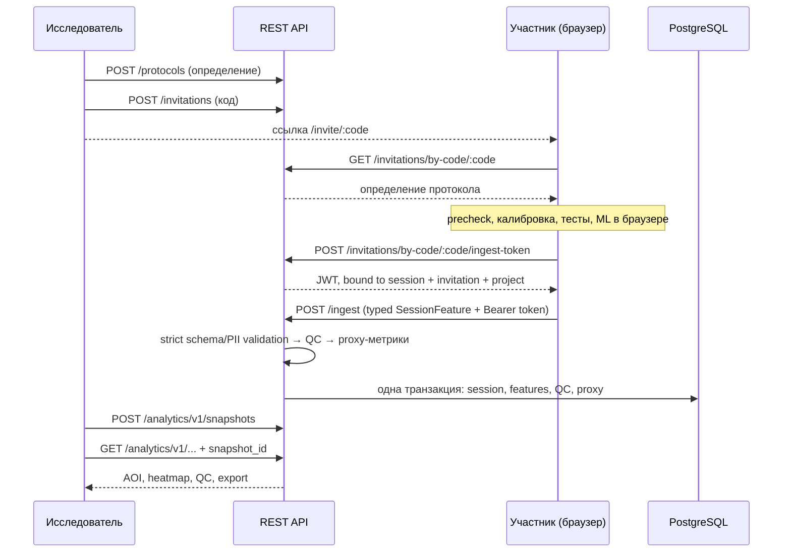
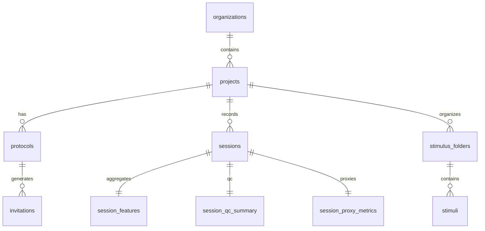
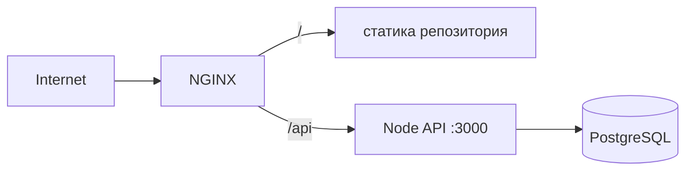

# EmoCog — web-emocog-core

[](LICENSE)
[](https://nodejs.org/)
[](apps/api)
[](apps/api/migrations)

**EmoCog** — веб-платформа для когнитивных исследований. Она снимает мультимодальные сигналы прямо в браузере участника (взгляд, моргания, пульс, эмоции, поза и время реакции), агрегирует их, прогоняет контроль качества (QC) и сохраняет на сервере, а исследователю даёт конструктор протоколов, приглашения, AOI-аналитику и экспорт.

Вся «тяжёлая» обработка (ML, rPPG, gaze-tracking) выполняется **на клиенте, в браузере**, без выгрузки сырого видео/аудио на сервер — наружу уходят только агрегированные метрики.

---
# Итоги аудита
https://docs.google.com/spreadsheets/d/1UtDw5Ra3S853evBQ6UfU6VtNPZ5VUmilYZIX2vgjOYs/edit?usp=sharing

Самые критичные проблемы, обязательные к исправлению в ближайшее время, вынесены в issue

## Содержание

1. [Возможности](#возможности)
2. [Нововведения спринтов 1-2](#нововведения-спринтов-1-2)
3. [Роли пользователей](#роли-пользователей)
4. [Архитектура](#архитектура)
5. [Технологический стек](#технологический-стек)
6. [Структура репозитория](#структура-репозитория)
7. [Быстрый старт](#быстрый-старт)
8. [Конфигурация](#конфигурация)
9. [REST API](#rest-api)
10. [База данных и миграции](#база-данных-и-миграции)
11. [Браузерный ML и сигнальные модули](#браузерный-ml-и-сигнальные-модули)
12. [Тестирование](#тестирование)
13. [Деплой](#деплой)
14. [Безопасность и приватность](#безопасность-и-приватность)
15. [Документация](#документация)
16. [Разработка и ветвление](#разработка-и-ветвление)
17. [Лицензия](#лицензия)

---

## Возможности

- **Конструктор экспериментов** — пошаговый билдер протоколов (блоки, стимулы, метрики, QC, аналитика) с сохранением JSON-определения.
- **Приглашения по коду** — участник заходит по ссылке `run_new.html?code=...` без регистрации.
- **Precheck и калибровка** — проверка камеры/освещения/позы перед запуском тестов.
- **Test Hub** — задания, которые участник проходит явно; gaze, blinks/PERCLOS, rPPG/BPM, emotion и body pose при этом работают фоново всю измерительную сессию:
  | Тест | Что измеряет |
  | --- | --- |
  | **RT** | время реакции (go/no-go) |
  | **Tracking** | слежение взглядом (gaze) |
  | **VPC** | visual paired comparison |
  | **Visuospatial** | зрительно-пространственный тест (рисование) |
- **Контроль качества (QC)** — серверная оценка валидности сессии (`valid` / `borderline` / `invalid`) с причинами брака.
- **Proxy-метрики** — производные индексы вовлечённости, стресса, качества восприятия, emot-cog.
- **Аналитика и экспорт** — session/group AOI-метрики, heatmap, QC, snapshot-based выгрузка в CSV/JSON без demo fallback.
- **RBAC и мультиарендность** — изоляция данных по организациям, роли `admin / PI / researcher / analyst / assistant / developer / respondent`.

---

## Нововведения спринтов 1-2

Этот release candidate объединяет защищённую серверную ветку с UX и
frontend-частью AOI/analytics из commit `530d7c2` (`update-from-wec-alfa`).
Новый дизайн S1-04 намеренно не переносился: сохранены текущая визуальная система
и пользовательский путь из ветки Ани. Из её commit не переносились отключение
auth guard, доверие к staff JWT в `localStorage` и demo fallback аналитики.

### Session runtime и typed transport

- Введена единая state machine: `idle -> instructions -> running ->
  paused/error -> finishing -> completed`.
- Пауза разрешена только на инструкции и завершается явным действием участника.
  Во время измерительного задания пауза запрещена.
- Качественные ошибки (освещение, поза, FPS, окклюзия) отделены от технических
  (камера, ML-модуль, сеть, ingest). Активные ошибки контролируются всю сессию.
- Повторяется не весь протокол, а только явно невалидный block/trial. Причина и
  количество повторов показываются после блока, не прерывая активное испытание.
- Reload восстанавливает checkpoint; незавершённый в момент reload блок считается
  невалидным и ставится в очередь повтора.
- Оставлен один сетевой transport: versioned `session_feature.v1` в `POST /ingest`.
  Legacy batch transport и автоматические промежуточные выгрузки удалены.
- `finishSession` идемпотентен. Повтор с тем же `Idempotency-Key` не создаёт
  features/QC/proxy повторно; активный блок или очередь обязательных повторов
  не позволяют завершить сессию.
- На финальном экране останавливаются камера и измерительные модули, после чего
  выполняется одна итоговая выгрузка.

### RT

- RT работает как явное когнитивное задание; сигнал и его агрегаты передаются
  через общий typed session transport.
- Сохранены keyboard/click ответы. Реакция по движению мыши включается только
  явным режимом `pointer-intent`, а не глобально для всех протоколов.
- `pointer-intent` использует минимальную амплитуду, dwell/debounce, защиту от
  micro-tremor и одно событие на trial. Синтетические события не принимаются.
- Web task IDs нормализуются в contract Python-анализатора; при его недоступности
  ingest не падает, а возвращает технический статус `analyzer_unavailable`.
- Спорное решение: движение мыши нельзя считать реакцией в стратегиях или
  обычных анкетах без явного дизайна задания. Режим выбирается протоколом.
- До научной приёмки нужен benchmark на реальных мышах и touchpad: latency,
  false-positive tremor rate, omission rate и согласование click vs pointer.

### Gaze on target

- MediaPipe Face/Iris landmarks используются как открытая браузерная основа;
  модельные assets хранятся на application origin, без runtime-загрузки с CDN.
- Калибровочные target coordinates берутся из `getBoundingClientRect()` и
  `visualViewport`. Панель вкладок/адресная строка не входят в content viewport,
  поэтому координаты страницы не смешиваются с координатами физического экрана.
- Signal pipeline разделён на `raw`, `corrected` и `display`. Display smoothing
  больше не подаётся обратно на вход и не создаёт запаздывающий дубликат траектории.
- Iris features, head pose и head translation оцениваются отдельно. Естественные
  движения головы допускаются, а выход из калибровочного распределения блокируется
  confidence/OOD gate вместо рисования заведомо неверной точки.
- Prediction target-blind: положение текущей фигуры не используется для
  подтягивания gaze point к ожидаемой цели.
- Калибровочная коррекция оценивается LOOCV, а validation остаётся независимой.
  Сохраняются baseline-versus-new показатели и причины отбраковки.
- Heatmap строится по фактическим валидным gaze samples отдельно для каждого
  stimulus/presentation, а не по координатам интерфейсных targets.
- До научной приёмки обязателен benchmark минимум на 5 участниках и 2 ноутбуках:
  accuracy в градусах/пикселях, precision/jitter, latency, head-motion robustness,
  off-screen specificity и baseline comparison.

### Blinks и PERCLOS

- Blink detection работает с начала непрерывного измерения до teardown, а не
  только во время precheck или калибровки.
- Сохраняются общее количество, duration, amplitude, opening speed, incomplete
  blink признаки и PERCLOS по окну наблюдения.
- Калибровочные samples и whole-session aggregates разделены, чтобы precheck не
  обнулял итоговые показатели.
- PERCLOS и blink dynamics являются исследовательскими индикаторами, но не
  медицинским диагнозом. Нужна проверка относительно размеченного видео при
  разных очках, освещении, частоте кадров и частичных окклюзиях.

### rPPG / BPM, эмоции и поза

- BPM/rPPG, emotion/FACS, head pose и движение корпуса работают фоново всю
  измерительную сессию. Они не отображаются как отдельные задания Test Hub.
- Удалён standalone BPM block, который создавал ложный soft lock и требовал
  повтор уже успешно завершённого блока.
- Body posture summary считается по whole-session accumulator даже после
  ограничения числа хранимых samples.
- Quality detector использует sustained thresholds: краткое движение головы или
  единичный FPS drop не бракуют trial; длительная проблема фиксируется с интервалом.
- Нужна отдельная real-device проверка BPM/emotion/body pose на разных тонах кожи,
  освещении, камерах, очках и фоновых движениях. Сырые кадры на сервер не уходят.

### AOI и конструктор протоколов

- AOI поддерживает rectangle и polygon в normalized coordinates, versioned schema
  и привязку к конкретному stimulus/block/presentation.
- Geometry проверяется на клиенте и сервере: диапазон координат, пустая область,
  duplicate IDs, self-intersection, интервалы и версия контракта.
- AOI сериализуется в protocol definition и восстанавливается без потери данных.
- В конструктор интегрированы AOI editor, stimulus preview, импорт протокола и
  серверная уникальность имени протокола внутри проекта.
- До приёмки нужен researcher walkthrough: создать AOI, сохранить, перезагрузить,
  опубликовать, пройти invitation и увидеть метрики именно этой presentation.

### Analytics, heatmap и export

- Добавлены production endpoints `/analytics/v1/*`: filter options, immutable
  snapshots, session/group metrics, AOI, heatmap, comparison readiness и export.
- Group metrics используют participant-equal aggregation; участник с большим
  числом samples не получает больший вес автоматически.
- Ноль отделён от отсутствующих данных. QC, missingness и device composition
  возвращаются явно; confidence interval не создаётся при недостаточном N.
- CSV/JSON export поддерживает `summary`, `long` и `both`, содержит dictionary,
  provenance, snapshot/dataset hash и нейтрализацию spreadsheet formulas.
- Analytics UI из ветки Ани подключён к реальному API. Demo fixture доступна
  только в явном localhost preview и не подменяет production результаты.
- Level 2 модели/интерпретации не включаются до утверждения исследовательского
  метода и минимального размера выборки.

### Stimuli и конвертация PDF/PPT/PPTX

- Реализован `POST /stimuli/convert`, которого не было за frontend-кнопкой Ани.
- Формат проверяется по расширению и binary signature до запуска конвертера.
- Размер, число страниц, timeout и concurrency ограничены. Для обработки нужны
  LibreOffice и Poppler; каждая страница становится server-owned image stimulus.
- Временные файлы очищаются, `content_path` не принимается от клиента, absolute
  path и `..` не могут выйти за `UPLOADS_ROOT`.
- Перед production нужны smoke tests PDF/PPT/PPTX с кириллицей, embedded fonts,
  прозрачностью, крупными файлами, повреждёнными архивами и timeout конвертера.

### Backend, роли и безопасность

- Browser staff auth переведён на `HttpOnly` cookie + CSRF. Bearer JWT оставлен
  для внешних API-клиентов и не сохраняется login UI в `localStorage`.
- Введена матрица `role x operation x own/foreign tenant`. Project/organization
  memberships обязательны; platform-wide scope доступен только platform-admin.
- Invitation code после consent обменивается на короткоживущий ingest token,
  связанный с session + invitation + project + protocol. Mismatch возвращает `409`.
- Admission атомарно резервирует `used_runs` и создаёт immutable placeholder
  session. Параллельные запросы не превышают `max_runs`; повтор той же session
  идемпотентен.
- Session/features/QC/proxy записываются транзакционно с lock/rollback. Ingest
  использует allowlist schema, PII/unknown-field rejection, body/depth/array
  limits, route-specific CORS/rate limits и безопасные server-owned paths.
- Hard-coded admin bypass удалён; bootstrap platform-admin выполняется отдельной
  операционной командой `npm run admin:bootstrap`.
- API/import-derived значения экранируются в researcher/developer UI; закрыты
  найденные persistent-XSS sinks.

### Принятые спорные решения

| Случай | Текущее решение | Что ещё требуется |
| --- | --- | --- |
| Участник дал consent, но закрыл вкладку | Admission учитывается в `used_runs`; автоматического возврата квоты нет, чтобы не допустить oversubscription и поздний двойной ingest | утвердить retention/monitoring abandoned sessions |
| Invitation в URL | после admission код удаляется через `history.replaceState`; referrer закрыт | для усиления privacy перейти на server-side HttpOnly participant session |
| Ошибка качества внутри trial | trial завершается, затем показывается причина и назначается точный повтор | UX-приёмка формулировок и порогов QC |
| Краткое движение головы/FPS drop | не бракует trial без sustained threshold | подобрать thresholds на реальных устройствах |
| Off-screen/низкая confidence gaze | sample отбрасывается, точка не притягивается к target | измерить specificity и missingness |
| Недостаточный N в аналитике | CI/сравнение помечается как недоступное, значение не выдумывается | утвердить minimum-N policy |

### Проверено и осталось проверить

Автоматические результаты текущего release candidate:

- API unit/security/contracts: `150/150`.
- PostgreSQL integration: `14/14`, включая rollback, token mismatch, tenant
  isolation и 20 параллельных admission requests при `max_runs=5`.
- Researcher + participant Chromium E2E: `15/15`.
- Production analytics Chromium E2E: `4/4`.
- HTTP contracts: `5 passed`, `1 skipped`; privileged path пропущенного сценария
  покрыт PostgreSQL integration test.
- Все 14 миграций: чистая БД `up -> down -> up`.
- PDF/PPTX smoke, JS/MJS/JSON syntax, TypeScript и dependency audit проходят;
  известных npm vulnerabilities нет.

Автотесты не заменяют следующие release gates:

1. Real-device benchmark gaze, blink, RT, BPM, emotion и body pose.
2. Load test, multi-instance rate limiter, durable object storage и мониторинг.
3. Backup/restore drill, incident runbook, secret/SAST/dependency scans в CI.
4. Независимый DOM-XSS/CSP review legacy researcher UI.
5. Формальная приёмка ответственного и тимлида после зелёного CI.

Подробный аудит: [docs/reports/2026-08-07-s1-s2-integration.md](docs/reports/2026-08-07-s1-s2-integration.md).

---

## Роли пользователей

| Роль | Интерфейс | Действия |
| --- | --- | --- |
| **Исследователь** | [apps/web/researcher.html](apps/web/researcher.html) | организации, проекты, протоколы, приглашения, стимулы, аналитика, экспорт |
| **Участник** | [apps/participant-web/](apps/participant-web/) | прохождение протокола по коду приглашения: precheck, калибровка, Test Hub |
| **Разработчик** | [apps/web/developer.html](apps/web/developer.html) | отладочные RT/BPM-тесты, проверка алгоритмов |

---

## Архитектура



### Поток данных участника



Подробнее — [docs/architecture.md](docs/architecture.md).
Lifecycle сессии и версионированные контракты — [docs/api/session-runtime-v1.md](docs/api/session-runtime-v1.md).
Матрица ролей и tenant scope — [docs/api/authorization-matrix-v1.md](docs/api/authorization-matrix-v1.md).
Методические основания gaze/blink/body — [docs/research/gaze-blink-body-methods.md](docs/research/gaze-blink-body-methods.md).

---

## Технологический стек

| Слой | Технологии |
| --- | --- |
| **Backend** | Node.js ≥18, Express 4, PostgreSQL (`pg`, без ORM), JWT/cookie auth, `bcryptjs`, `express-validator`, `multer`, `node-pg-migrate`, `cors`, `dotenv`; LibreOffice + Poppler для PDF/PPT/PPTX |
| **Frontend** | статический HTML/JS/CSS, ES-модули, **без сборщика**; конфигурация через `localStorage` |
| **Браузерный ML** | MediaPipe (Face Mesh / Iris), собственные движки rPPG и emotion/FACS |
| **Оффлайн-анализ** | Python (`rt_component-` — разбор RT-логов; `Audio_detection` — голосовые биомаркеры) |
| **Тесты** | `node --test` (API), Playwright (e2e/контракт) |

---

## Структура репозитория

```
web-emocog-core/
├── index.html                 # редирект → apps/web/index.html
├── apps/
│   ├── api/                    # Node.js REST API
│   │   ├── server.js           #   каноническая точка входа → app.js
│   │   ├── config/             #   загрузка env/конфига
│   │   ├── middleware/         #   cookie/bearer auth + RBAC
│   │   ├── analytics/          #   snapshot-based AOI analytics/export
│   │   ├── security/           #   permissions, schemas, HTTP hardening
│   │   ├── stimuli/            #   безопасная конвертация документов
│   │   ├── routes/             #   эндпоинты
│   │   ├── migrations/         #   node-pg-migrate
│   │   ├── qc/                 #   агрегатор контроля качества
│   │   ├── proxy_metrics/      #   контракт/доступ/репозиторий proxy-метрик
│   │   ├── rt/                 #   серверный разбор RT-фич
│   │   ├── schemas/            #   JSON-схемы (rt_features.v1)
│   │   └── tests/              #   unit / contract тесты
│   ├── web/                    # UI исследователя и разработчика
│   │   ├── researcher.html     #   консоль исследователя
│   │   ├── researcher-*.js     #   модули консоли (core/builder/analytics/...)
│   │   └── developer.html
│   ├── participant-web/        # UI участника + браузерный ML
│   │   ├── run_new.html        #   вход по ?code=
│   │   ├── mvp_with_precheck_1-updated.html  # полный flow
│   │   └── js/                 #   gaze-tracker, emotion, qc-metrics, web-page, ...
│   ├── researcher-web/         # app-shell + конвертер (Python)
│   ├── shared/                 # общий JS (rt-registry.js)
│   └── autotests/              # Playwright-тесты
├── lib/
│   └── rppg_alg_qc_test_web_alg_test_v10/   # rPPG/BPM движок (ES-модули)
├── rt_component-/              # Python RT-анализ (оффлайн)
├── Audio_detection/            # ядро голосовых биомаркеров (standalone)
├── deploy/                     # nginx-сниппеты
├── docs/                       # architecture.md, api/
├── ml/, packages/, db/, docker/, scripts/   # скелет монорепы (заготовки)
└── LICENSE                     # Apache-2.0
```

> Репозиторий организован как монорепо **без workspace-тулинга** — у каждого приложения свои зависимости. Часть директорий верхнего уровня (`ml/`, `packages/`, `db/`, `docker/`, `scripts/`) — заготовки под будущее развитие.

---

## Быстрый старт

### Требования

- Node.js ≥ 18
- PostgreSQL ≥ 13
- Современный браузер с доступом к камере (для участника)
- LibreOffice (`soffice`) и Poppler (`pdfinfo`, `pdftoppm`) для конвертации PDF/PPT/PPTX

### 1. Backend (API)

```bash
cd apps/api
cp .env.example .env          # отредактируйте DATABASE_URL и JWT_SECRET
npm install
npm run migrate:up            # применить миграции схемы БД
npm start                     # канонический API, порт из PORT (по умолчанию 3000)
# или для разработки с авто-перезапуском:
npm run dev
```

Проверка живости: `GET /health`, готовность к БД: `GET /ready`.

### 2. Frontend (статика)

Фронтенд — статические файлы без сборки. Для локального запуска поднимите любой статический сервер из корня репозитория:

```bash
# из корня репозитория
npx http-server -p 8080
# или
python3 -m http.server 8080
```

Затем откройте:
- **Исследователь:** `http://localhost:8080/apps/web/researcher.html`
- **Вход staff:** `http://localhost:8080/apps/web/developer/login.html`
- **Участник:** `http://localhost:8080/apps/participant-web/run_new.html?code=<КОД_ПРИГЛАШЕНИЯ>`

Адрес API задаётся через `localStorage` (`emocog_api_base`) или `window.API_BASE`. Браузерный staff-вход использует `HttpOnly` cookie и CSRF; bearer JWT сохранён только для внешних API-клиентов и не записывается login-страницей в `localStorage`. На проде nginx раздаёт статику и проксирует `/api` на Node.

> **Важно для ES-модулей:** rPPG-движок в `lib/` подключается как ES-модуль и требует корректного `Content-Type: text/javascript`. Готовый сниппет — [deploy/nginx-snippet-emocog-lib.conf](deploy/nginx-snippet-emocog-lib.conf).

---

## Конфигурация

Переменные окружения API (образец — [apps/api/.env.example](apps/api/.env.example)):

| Переменная | Описание | По умолчанию |
| --- | --- | --- |
| `DATABASE_URL` | строка подключения PostgreSQL | `postgres://...localhost:5432/emocog` |
| `NODE_ENV` | `development` / `production` | `development` |
| `PORT` | порт API | `3000` |
| `JWT_SECRET` | секрет подписи JWT. В `production` **обязателен** (≥32 симв.), иначе API не стартует | dev-fallback |
| `JWT_EXPIRES_IN` | TTL staff-сессии/JWT | `1h` |
| `STAFF_SESSION_COOKIE` | имя `HttpOnly` cookie staff-сессии | `wecog_staff_session` |
| `INGEST_TOKEN_EXPIRES_IN` | TTL participant ingest token | `15m` |
| `FORCE_HTTPS` | отклонить HTTP с `426 https_required` | `true` |
| `CORS_ORIGINS` | точный allowlist browser origins | `https://wecog.ru` |
| `TRUST_PROXY_HOPS` | число доверенных reverse proxy; включать только при закрытом прямом доступе к Node | `0` |
| `AUTH_BODY_LIMIT` / `INGEST_BODY_LIMIT` / `DEFAULT_BODY_LIMIT` | лимиты тела по типу маршрута | `32kb` / `2mb` / `256kb` |
| `AUTH_RATE_LIMIT_PER_MINUTE` / `INGEST_RATE_LIMIT_PER_MINUTE` / `DEFAULT_RATE_LIMIT_PER_MINUTE` | rate limit по типу маршрута | `20` / `120` / `300` |
| `UPLOADS_ROOT` | server-owned корень бинарных файлов | `/var/lib/wecog/uploads` |
| `MAX_UPLOAD_BYTES` | максимальный размер одного файла | `52428800` |
| `MAX_DOCUMENT_BYTES` / `MAX_DOCUMENT_PAGES` | лимиты документа и страниц | `52428800` / `100` |
| `DOCUMENT_CONVERSION_TIMEOUT_MS` / `DOCUMENT_CONVERSION_CONCURRENCY` | timeout и параллелизм конвертации | `45000` / `2` |

Сгенерировать секрет: `openssl rand -base64 48`.

Публичная регистрация всегда создаёт `respondent`. Platform-admin создаётся
отдельной операционной командой `npm run admin:bootstrap`; email-bypass в
HTTP-коде отсутствует.

---

## REST API

Базовый префикс на проде — обычно `/api`. Browser staff использует `HttpOnly` cookie и `X-CSRF-Token` для изменяющих запросов; внешние staff-клиенты могут использовать `Authorization: Bearer <JWT>`. Participant получает отдельный server-issued token, связанный с invitation/session/project/protocol.

| Группа | Префикс | Назначение |
| --- | --- | --- |
| Auth | `/auth` | регистрация, вход, профиль, управление пользователями и доступом developer |
| Organizations | `/organizations` | организации (мультиарендность) |
| Projects | `/projects` | исследовательские проекты |
| Protocols | `/protocols` | JSON-определения сценариев |
| Invitations | `/invitations` | коды доступа участников (`/by-code/:code` — публичный) |
| Sessions | `/sessions` | сессии, детали, QC и proxy-метрики |
| Ingest | `/ingest` | единый typed `session_feature.v1` transport (staff или participant token) |
| Export | `/export` | выгрузка CSV |
| Analytics v1 | `/analytics/v1` | filters, immutable snapshots, session/group AOI, heatmap, comparison readiness, CSV/JSON export |
| Experiments | `/experiments` | сводка экспериментов и недавние сессии |
| Stimuli | `/stimuli` | библиотека, server-owned content paths, `POST /stimuli/convert` для PDF/PPT/PPTX |
| Proxy-metrics | `/proxy-metrics` | контракт proxy-метрик v1 (`/schema`) |
| Health | `/health`, `/ready` | проверки живости/готовности (без авторизации) |

Полный справочник эндпоинтов, контракт ingest-payload и описание ролей — [apps/api/README.md](apps/api/README.md).

---

## База данных и миграции

PostgreSQL, схема версионируется через `node-pg-migrate` ([apps/api/migrations/](apps/api/migrations/)). Агрегаты сессий хранятся в JSONB.

```bash
cd apps/api
npm run migrate:up         # применить
npm run migrate:down       # откатить последнюю
npm run migrate:create -- <name>   # создать новую
```

Ключевые таблицы: `users`, `organizations` / `user_organizations`, `projects` / `user_projects`, `protocols`, `invitations`, `sessions`, `events`, `session_features`, `session_qc_summary`, `session_proxy_metrics`, `analysis_snapshots`, `stimulus_folders` / `stimuli`, `developer_access_emails`.



---

## Браузерный ML и сигнальные модули

| Модуль | Расположение | Назначение |
| --- | --- | --- |
| **Gaze tracker** | [js/gaze-tracker/](apps/participant-web/js/gaze-tracker/) · [README](apps/participant-web/js/gaze-tracker/README.md) | слежение взглядом на MediaPipe Face Mesh / Iris, калибровка |
| **Gaze tests** | [js/gaze-tracker/gaze-tests/](apps/participant-web/js/gaze-tracker/gaze-tests/) · [README](apps/participant-web/js/gaze-tracker/gaze-tests/README.md) | сценарии тестов: tracking, VPC, visuospatial |
| **PreCheck analyzer** | [js/precheck-analyzer/](apps/participant-web/js/precheck-analyzer/) · [README](apps/participant-web/js/precheck-analyzer/README.md) | проверка камеры/освещения/позы перед тестами |
| **Face segmenter** | [js/face-segmenter/](apps/participant-web/js/face-segmenter/) · [README](apps/participant-web/js/face-segmenter/README.md) | сегментация лица/кожи для ROI |
| **rPPG / BPM** | [lib/rppg_alg_qc_test_web_alg_test_v10/](lib/rppg_alg_qc_test_web_alg_test_v10/) · [README](lib/rppg_alg_qc_test_web_alg_test_v10/README.md) | оценка пульса и дыхания из видеосигнала лица |
| **Emotion / FACS** | [js/emotion/](apps/participant-web/js/emotion/) | извлечение Action Units, классификация эмоций, валентность/возбуждение |
| **QC-метрики** | [js/qc-metrics/](apps/participant-web/js/qc-metrics/) · [README](apps/participant-web/js/qc-metrics/README.md) | клиентская оценка качества (лицо, взгляд, длительность, FPS) |
| **Audio (опц.)** | [Audio_detection/](Audio_detection/) · [README](Audio_detection/README.md) | ядро голосовых биомаркеров, эвристический анализ |

Сырое видео/аудио **не покидает браузер** — на сервер уходят только агрегированные метрики.

---

## Тестирование

### API (unit / contract)

```bash
cd apps/api
npm test                # node --test tests/*.test.js
npm run test:rt-python  # smoke-прогон Python RT-анализатора через stdin
```

### E2E и контрактные (Playwright)

```bash
cd apps/autotests
npm install
npx playwright install   # один раз — браузеры
npm test                 # все сценарии
npm run test:ui          # интерактивный режим
npm run test:api         # контракт API
npx playwright test --config=playwright.analytics.config.ts  # AOI/analytics UI
```

PostgreSQL security/integration suite запускается только на отдельной тестовой БД:

```bash
cd apps/api
S2_TEST_DATABASE_URL=postgres://... node --test tests/s2-postgres.integration.test.js
```

Подробнее — [apps/autotests/README.md](apps/autotests/README.md).

---

## Деплой

Актуальная production-версия: [https://wecog.ru](https://wecog.ru).

Типовая схема: nginx раздаёт статику из корня репозитория и проксирует `/api` на Node-процесс (порт `PORT`, по умолчанию 3000).



- Каноническая точка входа API: `server.js` (`npm start`).
- ES-модули из `lib/` требуют верного MIME — см. [deploy/nginx-snippet-emocog-lib.conf](deploy/nginx-snippet-emocog-lib.conf).
- Вход участника: `apps/participant-web/run_new.html?code=...`.
- Метаданные последнего деплоя фиксируются в [DEPLOY_VERSION.txt](DEPLOY_VERSION.txt).

---

## Безопасность и приватность

- **Cookie/bearer auth + RBAC** — browser staff работает через `HttpOnly` cookie и CSRF; доступ изолирован по organization/project memberships.
- **Строгая проверка PII** — ingest-payload с PII, неизвестными полями или
  превышением структурных лимитов отклоняется до записи.
- **Минимизация данных** — сырое видео/аудио обрабатывается локально и не передаётся на сервер.
- **HTTPS** — при `FORCE_HTTPS=true` небезопасные запросы отклоняются с `426`; API не редиректит POST-body или bearer token.
- **Секреты** — в `production` `JWT_SECRET` обязателен; не коммитьте `.env`.
- **Tenant/session integrity** — invitation и session не перепривязываются,
  participant ingest token проверяется по полному tuple, а ingest выполняется
  атомарно.
- **Upload confinement** — клиент не задаёт `content_path`; resolved путь
  обязан оставаться внутри `UPLOADS_ROOT`.

---

## Документация

**Общее**
- [docs/architecture.md](docs/architecture.md) — компоненты и поток данных

**Backend / API**
- [apps/api/README.md](apps/api/README.md) — справочник API, контракт payload, роли

**Участник (participant-web)**
- [PHASE0_README.md](apps/participant-web/PHASE0_README.md) — Фаза 0: инфобез и политика
- [PHASE1_README.md](apps/participant-web/PHASE1_README.md) — Фаза 1: QC, протокол, эмоции
- [PHASE2_README.md](apps/participant-web/PHASE2_README.md) — Фаза 2: ядро API и данные
- [js/web-page/README.md](apps/participant-web/js/web-page/README.md) — модули страницы участника
- [js/gaze-tracker/README.md](apps/participant-web/js/gaze-tracker/README.md) — Gaze Tracker
- [js/gaze-tracker/gaze-tests/README.md](apps/participant-web/js/gaze-tracker/gaze-tests/README.md) — Gaze Tests
- [js/gaze-tracker/gaze-tests/VPC_ATTRIBUTION.md](apps/participant-web/js/gaze-tracker/gaze-tests/VPC_ATTRIBUTION.md) — атрибуция стимулов VPC
- [js/precheck-analyzer/README.md](apps/participant-web/js/precheck-analyzer/README.md) — PreCheck Analyzer
- [js/face-segmenter/README.md](apps/participant-web/js/face-segmenter/README.md) — Face Segmenter
- [js/qc-metrics/README.md](apps/participant-web/js/qc-metrics/README.md) — QC Metrics

**rPPG / BPM**
- [lib/rppg_alg_qc_test_web_alg_test_v10/README.md](lib/rppg_alg_qc_test_web_alg_test_v10/README.md) — обзор движка
- [lib/rppg_alg_qc_test_web_alg_test_v10/rppg_alg/README.md](lib/rppg_alg_qc_test_web_alg_test_v10/rppg_alg/README.md) — библиотека `rppg_alg` (POS/CHROM, multi-ROI)

**Аудио**
- [Audio_detection/README.md](Audio_detection/README.md) — голосовые биомаркеры (ядро)
- [Audio_detection/docs/integration_contract_ru.md](Audio_detection/docs/integration_contract_ru.md) — контракт интеграции

**Прочее**
- [apps/autotests/README.md](apps/autotests/README.md) — автотесты (Playwright)
- [apps/researcher-web/README_converter.md](apps/researcher-web/README_converter.md) — конвертер протоколов

---

## Разработка и ветвление

- Основная ветка — `main` (прод). Интеграционная — `develop`.
- Фичи разрабатываются в отдельных ветках и вливаются в `develop`, затем `develop` → `main`.
- Frontend без сборки: правьте HTML/JS напрямую, проверяйте в браузере.
- Backend: соблюдайте миграции (`node-pg-migrate`) при изменениях схемы; покрывайте новую логику тестами в `apps/api/tests/`.

---

## Лицензия

[Apache License 2.0](LICENSE).
