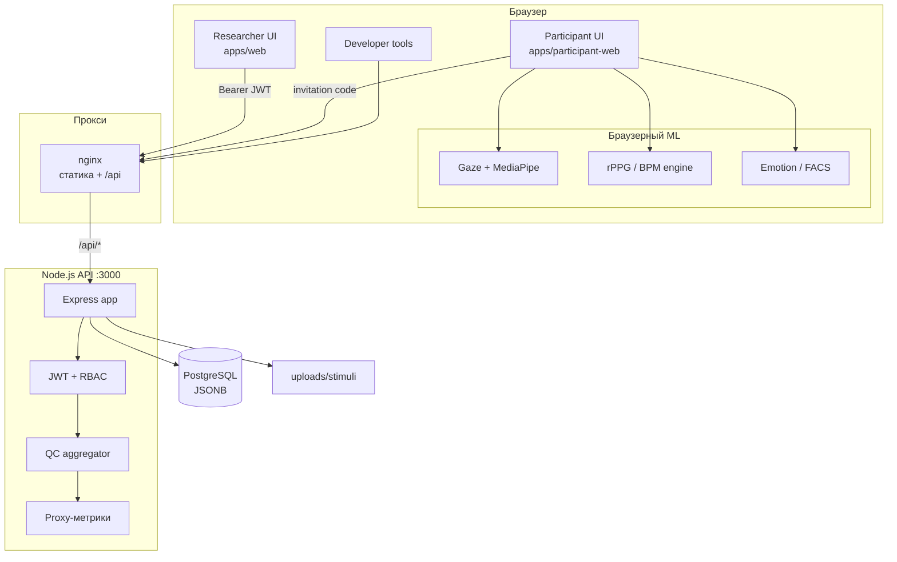
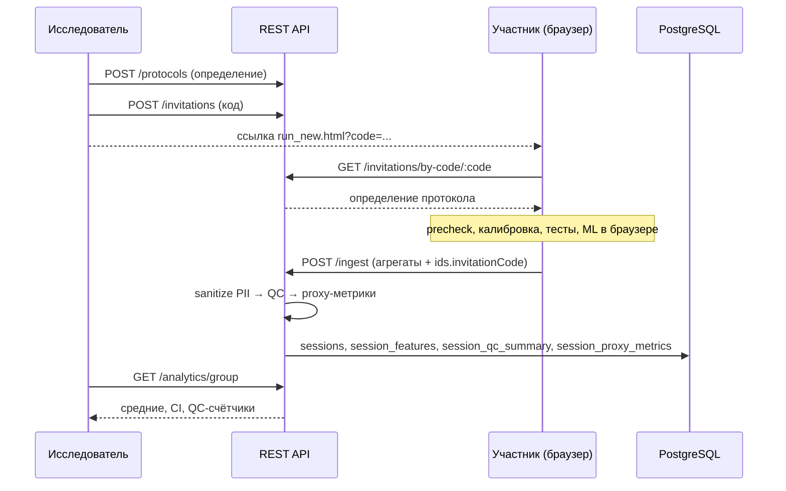
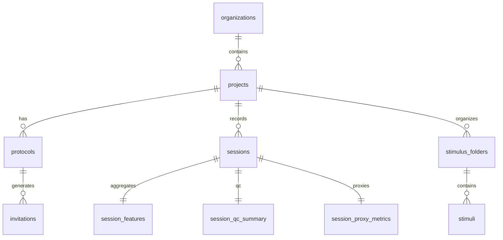
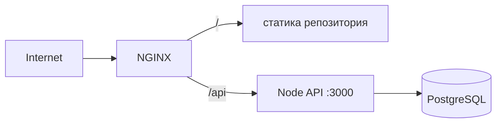

# EmoCog — web-emocog-core

[](LICENSE)
[](https://nodejs.org/)
[](apps/api)
[](apps/api/migrations)

**EmoCog** — веб-платформа для когнитивных исследований. Она снимает мультимодальные сигналы прямо в браузере участника (взгляд, пульс, эмоции, время реакции, опционально — голос), агрегирует их, прогоняет контроль качества (QC) и сохраняет на сервере, а исследователю даёт конструктор протоколов, приглашения, аналитику и экспорт.

Вся «тяжёлая» обработка (ML, rPPG, gaze-tracking) выполняется **на клиенте, в браузере**, без выгрузки сырого видео/аудио на сервер — наружу уходят только агрегированные метрики.

---
# Итоги аудита
https://docs.google.com/spreadsheets/d/1UtDw5Ra3S853evBQ6UfU6VtNPZ5VUmilYZIX2vgjOYs/edit?usp=sharing

Самые критичные проблемы, обязательные к исправлению в ближайшее время, вынесены в issue

## Содержание

1. [Возможности](#возможности)
2. [Роли пользователей](#роли-пользователей)
3. [Архитектура](#архитектура)
4. [Технологический стек](#технологический-стек)
5. [Структура репозитория](#структура-репозитория)
6. [Быстрый старт](#быстрый-старт)
7. [Конфигурация](#конфигурация)
8. [REST API](#rest-api)
9. [База данных и миграции](#база-данных-и-миграции)
10. [Браузерный ML и сигнальные модули](#браузерный-ml-и-сигнальные-модули)
11. [Тестирование](#тестирование)
12. [Деплой](#деплой)
13. [Безопасность и приватность](#безопасность-и-приватность)
14. [Документация](#документация)
15. [Разработка и ветвление](#разработка-и-ветвление)
16. [Лицензия](#лицензия)

---

## Возможности

- **Конструктор экспериментов** — пошаговый билдер протоколов (блоки, стимулы, метрики, QC, аналитика) с сохранением JSON-определения.
- **Приглашения по коду** — участник заходит по ссылке `run_new.html?code=...` без регистрации.
- **Precheck и калибровка** — проверка камеры/освещения/позы перед запуском тестов.
- **Test Hub** — набор тестов в браузере:
  | Тест | Что измеряет |
  | --- | --- |
  | **RT** | время реакции (go/no-go) |
  | **Tracking** | слежение взглядом (gaze) |
  | **BPM** | пульс по rPPG (видеосигнал лица) |
  | **VPC** | visual paired comparison |
  | **Visuospatial** | зрительно-пространственный тест (рисование) |
- **Контроль качества (QC)** — серверная оценка валидности сессии (`valid` / `borderline` / `invalid`) с причинами брака.
- **Proxy-метрики** — производные индексы вовлечённости, стресса, качества восприятия, emot-cog.
- **Аналитика и экспорт** — групповые средние, доверительные интервалы, QC-дашборд, выгрузка в CSV.
- **RBAC и мультиарендность** — изоляция данных по организациям, роли `admin / PI / researcher / analyst / assistant / developer / respondent`.

---

## Роли пользователей

| Роль | Интерфейс | Действия |
| --- | --- | --- |
| **Исследователь** | [apps/web/researcher.html](apps/web/researcher.html) | организации, проекты, протоколы, приглашения, стимулы, аналитика, экспорт |
| **Участник** | [apps/participant-web/](apps/participant-web/) | прохождение протокола по коду приглашения: precheck, калибровка, Test Hub |
| **Разработчик** | [apps/web/developer.html](apps/web/developer.html) | отладочные RT/BPM-тесты, проверка алгоритмов |

---

## Архитектура



### Поток данных участника



Подробнее — [docs/architecture.md](docs/architecture.md).

---

## Технологический стек

| Слой | Технологии |
| --- | --- |
| **Backend** | Node.js ≥18, Express 4, PostgreSQL (`pg`, без ORM), JWT (`jsonwebtoken`), `bcryptjs`, `express-validator`, `multer`, `node-pg-migrate`, `cors`, `dotenv` |
| **Frontend** | статический HTML/JS/CSS, ES-модули, **без сборщика**; конфигурация через `localStorage` |
| **Браузерный ML** | MediaPipe (Face Mesh / Iris), собственные движки rPPG и emotion/FACS |
| **Оффлайн-анализ** | Python (`rt_component-` — разбор RT-логов; `Audio_detection` — голосовые биомаркеры) |
| **Тесты** | `node --test` (API), Playwright (e2e/контракт) |

---

## Структура репозитория

```
web-emocog-core/
├── index.html                 # редирект → apps/web/index.html
├── apps/
│   ├── api/                    # Node.js REST API
│   │   ├── server.js           #   точка входа (Phase 2) → app.js
│   │   ├── server_phase4_updated.js  # точка входа (Phase 4, прод) → app_phase4_updated.js
│   │   ├── config/             #   загрузка env/конфига
│   │   ├── middleware/         #   auth (JWT + RBAC)
│   │   ├── routes/             #   эндпоинты
│   │   ├── migrations/         #   node-pg-migrate
│   │   ├── qc/                 #   агрегатор контроля качества
│   │   ├── proxy_metrics/      #   контракт/доступ/репозиторий proxy-метрик
│   │   ├── rt/                 #   серверный разбор RT-фич
│   │   ├── schemas/            #   JSON-схемы (rt_features.v1)
│   │   └── tests/              #   unit / contract тесты
│   ├── web/                    # UI исследователя и разработчика
│   │   ├── researcher.html     #   консоль исследователя
│   │   ├── researcher-*.js     #   модули консоли (core/builder/analytics/...)
│   │   └── developer.html
│   ├── participant-web/        # UI участника + браузерный ML
│   │   ├── run_new.html        #   вход по ?code=
│   │   ├── mvp_with_precheck_1-updated.html  # полный flow
│   │   └── js/                 #   gaze-tracker, emotion, qc-metrics, web-page, ...
│   ├── researcher-web/         # app-shell + конвертер (Python)
│   ├── shared/                 # общий JS (rt-registry.js)
│   └── autotests/              # Playwright-тесты
├── lib/
│   └── rppg_alg_qc_test_web_alg_test_v10/   # rPPG/BPM движок (ES-модули)
├── rt_component-/              # Python RT-анализ (оффлайн)
├── Audio_detection/            # ядро голосовых биомаркеров (standalone)
├── deploy/                     # nginx-сниппеты
├── docs/                       # architecture.md, api/
├── ml/, packages/, db/, docker/, scripts/   # скелет монорепы (заготовки)
└── LICENSE                     # Apache-2.0
```

> Репозиторий организован как монорепо **без workspace-тулинга** — у каждого приложения свои зависимости. Часть директорий верхнего уровня (`ml/`, `packages/`, `db/`, `docker/`, `scripts/`) — заготовки под будущее развитие.

---

## Быстрый старт

### Требования

- Node.js ≥ 18
- PostgreSQL ≥ 13
- Современный браузер с доступом к камере (для участника)

### 1. Backend (API)

```bash
cd apps/api
cp .env.example .env          # отредактируйте DATABASE_URL и JWT_SECRET
npm install
npm run migrate:up            # применить миграции схемы БД
npm run start:phase4          # прод-вход (Phase 4), порт из PORT (по умолчанию 3000)
# или для разработки с авто-перезапуском:
npm run dev                   # server.js (Phase 2)
```

Проверка живости: `GET /health`, готовность к БД: `GET /ready`.

### 2. Frontend (статика)

Фронтенд — статические файлы без сборки. Для локального запуска поднимите любой статический сервер из корня репозитория:

```bash
# из корня репозитория
npx http-server -p 8080
# или
python3 -m http.server 8080
```

Затем откройте:
- **Исследователь:** `http://localhost:8080/apps/web/researcher.html`
- **Участник:** `http://localhost:8080/apps/participant-web/run_new.html?code=<КОД_ПРИГЛАШЕНИЯ>`

Адрес API задаётся через `localStorage` (`emocog_api_base`) или `window.API_BASE`; токен — `emocog_api_token`. На проде nginx раздаёт статику и проксирует `/api` на Node (см. [Деплой](#деплой)).

> **Важно для ES-модулей:** rPPG-движок в `lib/` подключается как ES-модуль и требует корректного `Content-Type: text/javascript`. Готовый сниппет — [deploy/nginx-snippet-emocog-lib.conf](deploy/nginx-snippet-emocog-lib.conf).

---

## Конфигурация

Переменные окружения API (образец — [apps/api/.env.example](apps/api/.env.example)):

| Переменная | Описание | По умолчанию |
| --- | --- | --- |
| `DATABASE_URL` | строка подключения PostgreSQL | `postgres://...localhost:5432/emocog` |
| `NODE_ENV` | `development` / `production` | `development` |
| `PORT` | порт API | `3000` |
| `JWT_SECRET` | секрет подписи JWT. В `production` **обязателен** (≥32 симв.), иначе API не стартует | dev-fallback |
| `JWT_EXPIRES_IN` | TTL токена | `7d` |
| `FORCE_HTTPS` | редирект на HTTPS при `x-forwarded-proto != https` | `true` |
| `PROJECT_LEAD_EMAILS` | lead-почты с правом выдавать роль developer | — |
| `PROJECT_ADMIN_EMAILS` | почты, получающие роль admin при публичной регистрации | — |

Сгенерировать секрет: `openssl rand -base64 48`.

---

## REST API

Базовый префикс на проде — обычно `/api` (снимается/проксируется nginx). Авторизация: заголовок `Authorization: Bearer <JWT>`. Формат — JSON.

| Группа | Префикс | Назначение |
| --- | --- | --- |
| Auth | `/auth` | регистрация, вход, профиль, управление пользователями и доступом developer |
| Organizations | `/organizations` | организации (мультиарендность) |
| Projects | `/projects` | исследовательские проекты |
| Protocols | `/protocols` | JSON-определения сценариев |
| Invitations | `/invitations` | коды доступа участников (`/by-code/:code` — публичный) |
| Sessions | `/sessions` | сессии, детали, QC и proxy-метрики |
| Events | `/events` | сырые события (`/batch`, до 1000 за раз) |
| Ingest | `/ingest` | агрегированный payload сессии (JWT **или** `ids.invitationCode`) |
| Export | `/export` | выгрузка CSV |
| Analytics | `/analytics` | групповые средние, QC-дашборд, feature-строки |
| Experiments | `/experiments` | сводка экспериментов и недавние сессии |
| Stimuli | `/stimuli` | библиотека стимулов (загрузка файлов) |
| Proxy-metrics | `/proxy-metrics` | контракт proxy-метрик v1 (`/schema`) |
| Health | `/health`, `/ready` | проверки живости/готовности (без авторизации) |

Полный справочник эндпоинтов, контракт ingest-payload и описание ролей — [apps/api/README.md](apps/api/README.md).

---

## База данных и миграции

PostgreSQL, схема версионируется через `node-pg-migrate` ([apps/api/migrations/](apps/api/migrations/)). Агрегаты сессий хранятся в JSONB.

```bash
cd apps/api
npm run migrate:up         # применить
npm run migrate:down       # откатить последнюю
npm run migrate:create -- <name>   # создать новую
```

Ключевые таблицы: `users`, `organizations` / `user_organizations`, `projects`, `protocols`, `invitations`, `sessions`, `events`, `session_features`, `session_qc_summary`, `session_proxy_metrics`, `stimulus_folders` / `stimuli`, `developer_access_emails`.



---

## Браузерный ML и сигнальные модули

| Модуль | Расположение | Назначение |
| --- | --- | --- |
| **Gaze tracker** | [js/gaze-tracker/](apps/participant-web/js/gaze-tracker/) · [README](apps/participant-web/js/gaze-tracker/README.md) | слежение взглядом на MediaPipe Face Mesh / Iris, калибровка |
| **Gaze tests** | [js/gaze-tracker/gaze-tests/](apps/participant-web/js/gaze-tracker/gaze-tests/) · [README](apps/participant-web/js/gaze-tracker/gaze-tests/README.md) | сценарии тестов: tracking, VPC, visuospatial |
| **PreCheck analyzer** | [js/precheck-analyzer/](apps/participant-web/js/precheck-analyzer/) · [README](apps/participant-web/js/precheck-analyzer/README.md) | проверка камеры/освещения/позы перед тестами |
| **Face segmenter** | [js/face-segmenter/](apps/participant-web/js/face-segmenter/) · [README](apps/participant-web/js/face-segmenter/README.md) | сегментация лица/кожи для ROI |
| **rPPG / BPM** | [lib/rppg_alg_qc_test_web_alg_test_v10/](lib/rppg_alg_qc_test_web_alg_test_v10/) · [README](lib/rppg_alg_qc_test_web_alg_test_v10/README.md) | оценка пульса и дыхания из видеосигнала лица |
| **Emotion / FACS** | [js/emotion/](apps/participant-web/js/emotion/) | извлечение Action Units, классификация эмоций, валентность/возбуждение |
| **QC-метрики** | [js/qc-metrics/](apps/participant-web/js/qc-metrics/) · [README](apps/participant-web/js/qc-metrics/README.md) | клиентская оценка качества (лицо, взгляд, длительность, FPS) |
| **Audio (опц.)** | [Audio_detection/](Audio_detection/) · [README](Audio_detection/README.md) | ядро голосовых биомаркеров, эвристический анализ |

Сырое видео/аудио **не покидает браузер** — на сервер уходят только агрегированные метрики.

---

## Тестирование

### API (unit / contract)

```bash
cd apps/api
npm test                # node --test tests/*.test.js
npm run test:rt-python  # smoke-прогон Python RT-анализатора через stdin
```

### E2E и контрактные (Playwright)

```bash
cd apps/autotests
npm install
npx playwright install   # один раз — браузеры
npm test                 # все сценарии
npm run test:ui          # интерактивный режим
npm run test:api         # контракт API
```

Подробнее — [apps/autotests/README.md](apps/autotests/README.md).

---

## Деплой

Типовая схема: nginx раздаёт статику из корня репозитория и проксирует `/api` на Node-процесс (порт `PORT`, по умолчанию 3000).



- Прод-точка входа API: `server_phase4_updated.js` (`npm run start:phase4`).
- ES-модули из `lib/` требуют верного MIME — см. [deploy/nginx-snippet-emocog-lib.conf](deploy/nginx-snippet-emocog-lib.conf).
- Вход участника: `apps/participant-web/run_new.html?code=...`.
- Метаданные последнего деплоя фиксируются в [DEPLOY_VERSION.txt](DEPLOY_VERSION.txt).

---

## Безопасность и приватность

- **JWT + RBAC** — доступ к данным изолирован по организациям; роли проверяются middleware.
- **Санитизация PII** — перед записью ingest-payload удаляются поля, похожие на email/телефон/имя/адрес.
- **Минимизация данных** — сырое видео/аудио обрабатывается локально и не передаётся на сервер.
- **HTTPS** — при `FORCE_HTTPS=true` небезопасные запросы редиректятся; не передавайте PII в API.
- **Секреты** — в `production` `JWT_SECRET` обязателен; не коммитьте `.env`.

---

## Документация

**Общее**
- [docs/architecture.md](docs/architecture.md) — компоненты и поток данных

**Backend / API**
- [apps/api/README.md](apps/api/README.md) — справочник API, контракт payload, роли

**Участник (participant-web)**
- [PHASE0_README.md](apps/participant-web/PHASE0_README.md) — Фаза 0: инфобез и политика
- [PHASE1_README.md](apps/participant-web/PHASE1_README.md) — Фаза 1: QC, протокол, эмоции
- [PHASE2_README.md](apps/participant-web/PHASE2_README.md) — Фаза 2: ядро API и данные
- [js/web-page/README.md](apps/participant-web/js/web-page/README.md) — модули страницы участника
- [js/gaze-tracker/README.md](apps/participant-web/js/gaze-tracker/README.md) — Gaze Tracker
- [js/gaze-tracker/gaze-tests/README.md](apps/participant-web/js/gaze-tracker/gaze-tests/README.md) — Gaze Tests
- [js/gaze-tracker/gaze-tests/VPC_ATTRIBUTION.md](apps/participant-web/js/gaze-tracker/gaze-tests/VPC_ATTRIBUTION.md) — атрибуция стимулов VPC
- [js/precheck-analyzer/README.md](apps/participant-web/js/precheck-analyzer/README.md) — PreCheck Analyzer
- [js/face-segmenter/README.md](apps/participant-web/js/face-segmenter/README.md) — Face Segmenter
- [js/qc-metrics/README.md](apps/participant-web/js/qc-metrics/README.md) — QC Metrics

**rPPG / BPM**
- [lib/rppg_alg_qc_test_web_alg_test_v10/README.md](lib/rppg_alg_qc_test_web_alg_test_v10/README.md) — обзор движка
- [lib/rppg_alg_qc_test_web_alg_test_v10/rppg_alg/README.md](lib/rppg_alg_qc_test_web_alg_test_v10/rppg_alg/README.md) — библиотека `rppg_alg` (POS/CHROM, multi-ROI)

**Аудио**
- [Audio_detection/README.md](Audio_detection/README.md) — голосовые биомаркеры (ядро)
- [Audio_detection/docs/integration_contract_ru.md](Audio_detection/docs/integration_contract_ru.md) — контракт интеграции

**Прочее**
- [apps/autotests/README.md](apps/autotests/README.md) — автотесты (Playwright)
- [apps/researcher-web/README_converter.md](apps/researcher-web/README_converter.md) — конвертер протоколов

---

## Разработка и ветвление

- Основная ветка — `main` (прод). Интеграционная — `develop`.
- Фичи разрабатываются в отдельных ветках и вливаются в `develop`, затем `develop` → `main`.
- Frontend без сборки: правьте HTML/JS напрямую, проверяйте в браузере.
- Backend: соблюдайте миграции (`node-pg-migrate`) при изменениях схемы; покрывайте новую логику тестами в `apps/api/tests/`.

---

## Лицензия

[Apache License 2.0](LICENSE).
